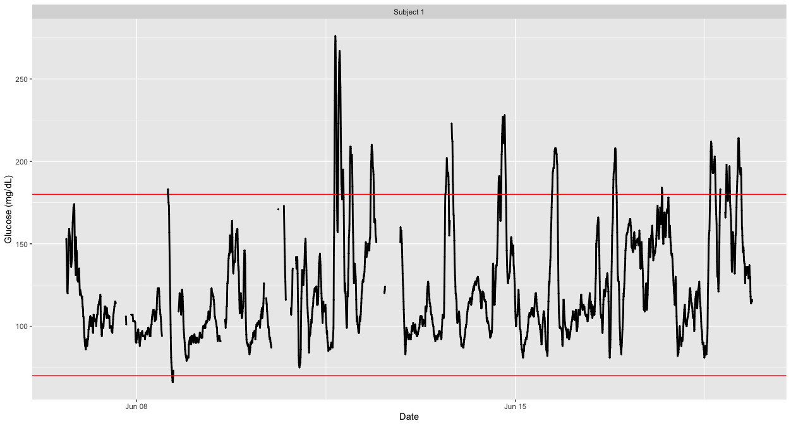

Diabetes is a chronic disease resulting from the pancreatic inability to produce insulin in reaction to blood glucose levels. There are two main types of diabetes. Type 1 diabetes is characterized by absolute insulin deficiency, whereas Type 2 is characterized by insulin resistance. In 2014, approximately $422$ million people worldwide were living with Type 1 or 2 diabetes, with $30$ million people being affected in the US alone.  High levels of blood glucose observed in diabetes lead to increased risk of adverse health effects including retinopathy, cardiovascular disease, lower extremity amputations  cognitive dysfunction, and premature morbidity and mortality. Thus, the primary treatment goal in diabetes is glucose control. However, a normal glucose profile is non-constant, with typical normal values varying between $70$-$120$ mg/dL and peaks associated with meal intakes. The highly non-linear and non-stationary nature of glucose profiles is due to a wide range of environmental factors including time, quantity and composition of meals, physical activity time, intensity and type, stress, and sleep quality.

<!--
<embed src="img/Subject1.pdf" width="100%" height="600px" type="application/pdf">

-->

Continuous Glucose Monitors (CGMs) are small wearable devices that measure the interstitial glucose levels continuously throughout the day, with some monitors taking measurements as often as every 5 minutes. Data from these monitors provide a detailed quantification of the variation in glucose levels during the course of the day, and thus CGMs play an increasing role in clinical practice. For more on CGMs, see [Rodbard (2016) "Continuous Glucose Monitoring: A Review of Successes, Challenges, and Opportunities."](https://doi.org/10.1089/dia.2015.0417).

Out group focuses on developing statistical methods to aid analyses and interpretation of CGM data. Some selected research products are below.

### CGM datasets

Our team has released [Awesome-CGM, a list of public Continuous Glucose Monitoring (CGM) datasets](https://github.com/irinagain/Awesome-CGM). <!--Thank you to an amazing team of undergraduate researchers: Mary Martin, Elizabeth Chun, David Buchanan, Eric Wang and Sangaman Senthil who assembled this collection as part of their [Aggie Research Project](https://aggieresearch.tamu.edu).--> 
To cite the most recent collection:

 * Xinran Xu, Neo Kok, Junyan Tan, Mary Martin, David Buchanan, Elizabeth Chun, Rucha Bhat, Shaun Cass, Eric Wang, Sangaman Senthil, & Irina Gaynanova. (2024). IrinaStatsLab/Awesome-CGM: Updated release with additional public CGM dataset and enhanced processing (v2.0.0). Zenodo.
 
Additionally, we released [Glucobench](https://github.com/IrinaStatsLab/GlucoBench), a collection of pre-processed public CGM data for forecasting (prediction of future glucose values) with implementation of multiple benchmark ML models. To cite Glucobench specifically

* Sergazinov R\*, Chun E\*, Rogovchenko V\*, Fernandes N\*, Kasman N\* and **Gaynanova I** (2024). [GlucoBench: Curated List of Continuous Glucose Monitoring Datasets with Prediction Benchmarks.](https://openreview.net/forum?id=cUSNs8nGaV) *International Conference on Learning Representations (ICLR)*.

### Software products:
* R package **iglu** for calculating various metrics from CGM glucose profiles, and visualizing the data. [Github repository](https://github.com/irinagain/iglu), [CRAN version](https://CRAN.R-project.org/package=iglu), [accompanying website](https://irinagain.github.io/iglu/) and [the paper](https://doi.org/10.1371/journal.pone.0248560). The package has graphical user interface via shiny app, which can be accessed locally after installing the package, or directly from the website (see below). To cite the current version of the package:
 
   
   - Chun E\*, Fernandes JN\* and **Gaynanova I** (2024) [An Update on the iglu Software for Interpreting Continuous Glucose Monitoring Data.](https://doi.org/10.1089/dia.2024.0154) *Diabetes Technology and Therapeutics,* Vol. 26, No. 12, 939-950.
  
   - Broll S\*, Urbanek J, Buchanan D\*, Chun E\*, Muschelli J, Punjabi N and **Gaynanova I** (2021).[Interpreting blood glucose data with R package iglu.](https://doi.org/10.1371/journal.pone.0248560) *PLoS One*, Vol. 16, No. 4, e0248560. 
 
* [Shiny app for **iglu**](https://irinagain.shinyapps.io/shiny_iglu/). R package **iglu** functionality directly via graphical user interface.

* [Slide Tutorial](https://irinagain.github.io/Resources/SlidesWorkshop.pdf), [Corresponding R script only](https://irinagain.github.io/Resources/SlidesWorkshop.R), [POSIT cloud project](https://posit.cloud/content/9833735)

* [Video tutorial on working with CGM data in iglu](https://www.birs.ca/events/2025/5-day-workshops/25w5474/videos/watch/202502260906-Gaynanova.html)

### Relevant publications:

* Park J\*, Kok N\* and **Gaynanova I** (2025+) [Beyond fixed thresholds: optimizing summaries of wearable device data via piecewise linearization of quantile functions](https://arxiv.org/abs/2501.11777)

* Coulter A\*, Aurora RN, Punjabi N and **Gaynanova I** (2025+). [Fast variable selection for distributional regression with application to continuous glucose monitoring data](https://arxiv.org/abs/2403.00922) *arXiv*

* Williamson W\*, Lee JM and **Gaynanova I** (2025) [A Processing Algorithm to Address Real-World Data Quality Issues With Continuous Glucose Monitoring Data](https://doi.org/10.1177/19322968251319801), *Journal fo Diabetes Science and Technology*, ahead of print.

* **Gaynanova I** and Lee JM (2025)  [When Algorithms Diverge: Quantification of Glycemic Episodes from Continuous Glucose Monitor Data](https://doi.org/10.1089/dia.2024.0618), *Diabetes Technology and Therapeutics*, ahead of print.

* Chun E\*, Fernandes JN\* and **Gaynanova I** (2024) [An Update on the iglu Software for Interpreting Continuous Glucose Monitoring Data.](https://doi.org/10.1089/dia.2024.0154) *Diabetes Technology and Therapeutics,* Vol. 26, No. 12, 939-950. [[CRAN R package]](https://CRAN.R-project.org/package=iglu) [[GitHub repository]](https://github.com/irinagain/iglu)

* Chun E\*,  **Gaynanova I**, Melanson E and Lyden, K (2024) [Pre- Versus Postmeal Sedentary Duration; Impact on Postprandial Glucose in Older Adults with Overweight or Obesity.](https://doi.org/10.1123/jmpb.2023-0032) *Journal for the Measurement of Physical Behaviour,* Vol. 7, No. 1.

* Sergazinov R\*, Chun E\*, Rogovchenko V\*, Fernandes N\*, Kasman N\* and **Gaynanova I** (2024). [GlucoBench: Curated List of Continuous Glucose Monitoring Datasets with Prediction Benchmarks.](https://openreview.net/forum?id=cUSNs8nGaV) *International Conference on Learning Representations (ICLR)*. [[GitHub repository]](https://github.com/IrinaStatsLab/GlucoBench)

* Sergazinov R\*, Leroux A, Cui E, Crainiceanu C, Aurora RN, Punjabi N and **Gaynanova I** (2023). [A case study of glucose levels during sleep using fast function on scalar regression inference.](https://doi.org/10.1111/biom.13878) *Biometrics*, Vol. 79, No. 4, 3873-3882.

* Sergazinov R\*, Armandpour M and **Gaynanova I** (2023). [Gluformer: Transformer-Based Personalized Glucose Forecasting with Uncertainty Quantification.](https://doi.org/10.1109/ICASSP49357.2023.10096419) *IEEE International Conference on Acoustics, Speech, and Signal Processing (ICASSP)* [[Python code]](https://github.com/mrsergazinov/gluformer)

* **Gaynanova I** (2022). [Digital biomarkers of glucose control - reproducibility challenges and opportunities.](https://higherlogicdownload.s3.amazonaws.com/AMSTAT/fa4dd52c-8429-41d0-abdf-0011047bfa19/UploadedImages/BIOP%20Report/BioPharm_spring2022_FINAL.pdf) ASA Biopharmaceutical Report, Vol. 29, No. 1, 21-26.

* Aurora RN, **Gaynanova I**, Patel P\*, and Punjabi N (2022). [Glucose profiles in obstructive sleep apnea and type 2 diabetes mellitus.](https://doi.org/10.1016/j.sleep.2022.04.007) *Sleep Medicine*, Vol. 95, 105-111

* **Gaynanova I**, Punjabi N and Crainiceanu C (2022). [Modeling continuous glucose monitoring (CGM) data during sleep.](https://doi.org/10.1093/biostatistics/kxaa023) *Biostatistics*, Vol. 23, No. 1, 223-239. [[R code]](https://github.com/irinagain/cgm-multi-level-beta)

* Fernandes N\*, Nguyen N\*, Chun E\*, Punjabi N and **Gaynanova I** (2022). [Open-Source Algorithm to Calculate Mean Amplitude of Glycemic Excursions Using Short and Long Moving Averages.](https://doi.org/10.1177/19322968211061165) *Journal of Diabetes Science and Technology*, Vol. 16,  No. 2, 576-577. [[Github page to reproduce]](https://github.com/Nathaniel-Fernandes/mage_algorithm_data) [[R package with implementation]](https://github.com/irinagain/iglu)

 * Broll S\*, Urbanek J, Buchanan D\*, Chun E\*, Muschelli J, Punjabi N and **Gaynanova I** (2021). [Interpreting blood glucose data with R package iglu.](https://doi.org/10.1371/journal.pone.0248560) *PLoS One*, Vol. 16, No. 4, e0248560. [[R package]](https://cran.rstudio.com/web/packages/iglu/index.html)

 * **Gaynanova I**, Urbanek J and Punjabi N (2018). [Letter to the Editor: Corrections of equations on glycemic variability and quality of glycemic control.](https://www.liebertpub.com/doi/pdfplus/10.1089/dia.2018.0057) *Diabetes Technology & Therapeutics*, Vol. 20, No. 4, 317.
