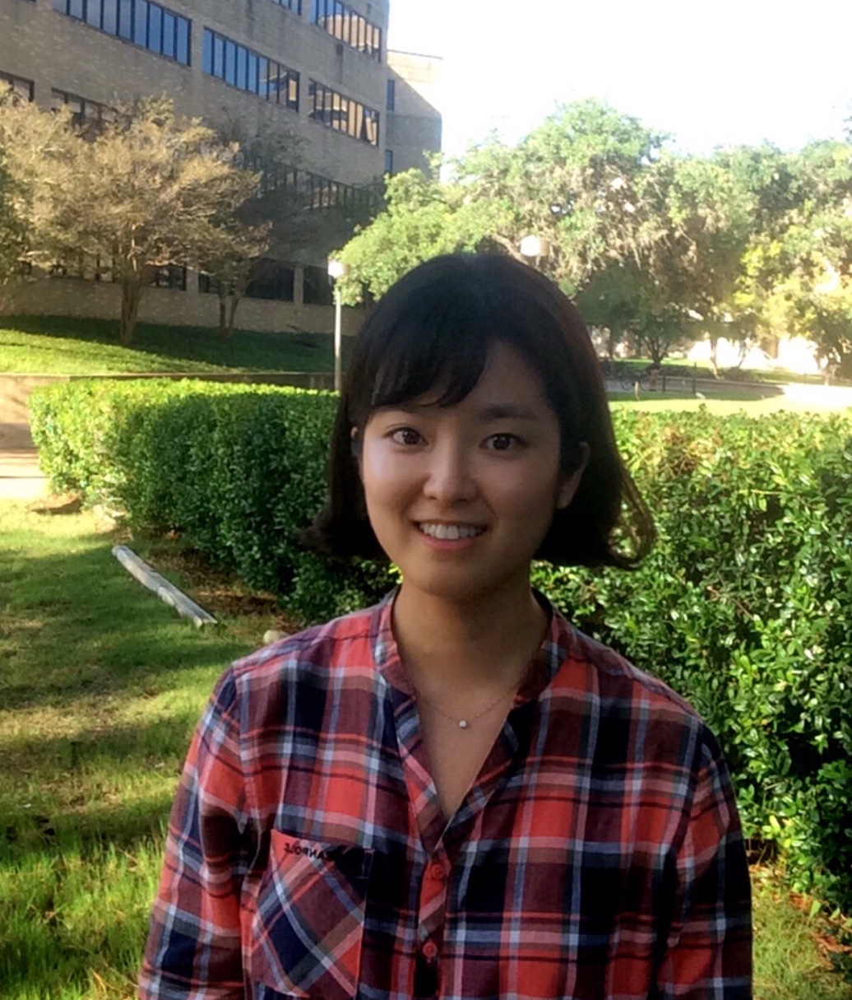
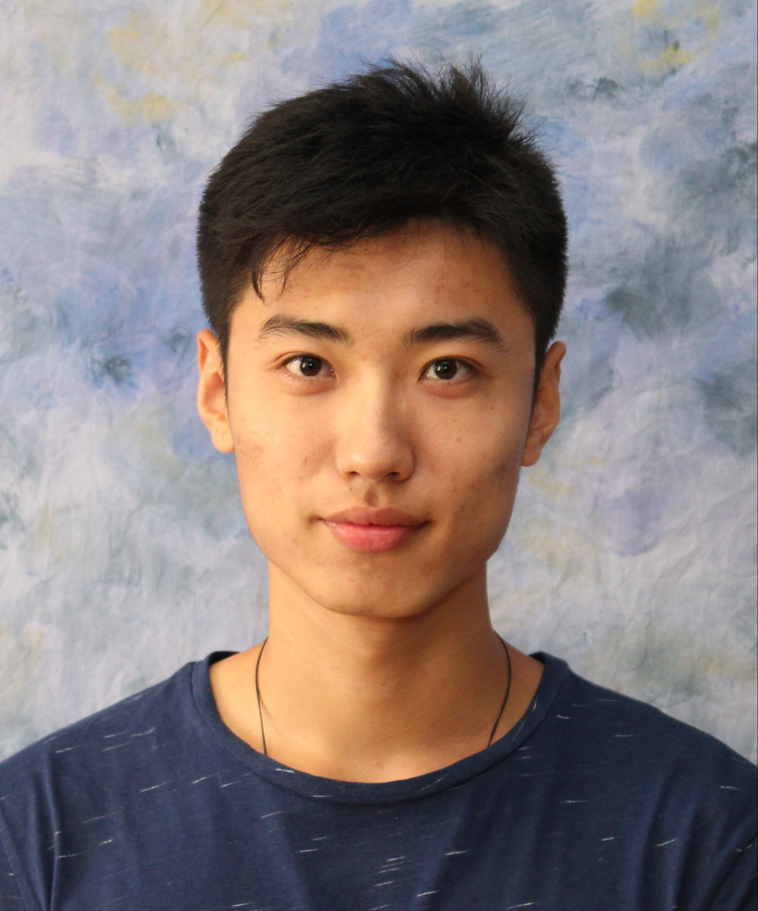
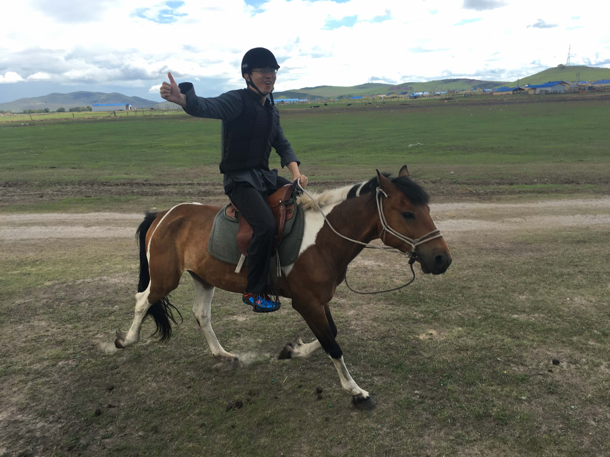
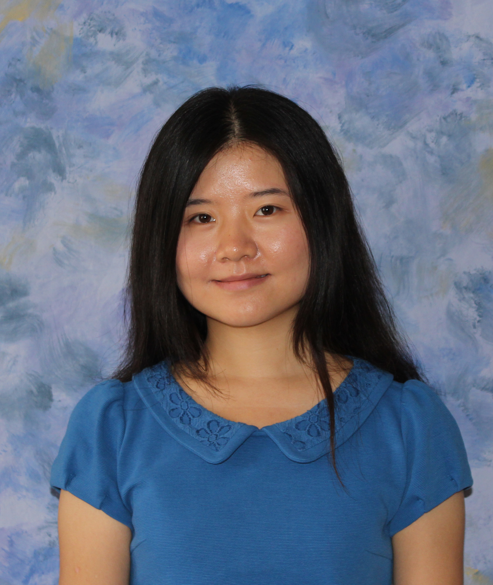

### RESEARCH GROUP MEMBERS

&nbsp;

	

	

	

		
 <a href="irinagain.github.io"> Irina Gaynanova </a>  
		Assistant Professor of Statistics 

	

<!-- Irina Gaynanova -->

	

	

	

		
<a href="http://www.stat.tamu.edu/~gyoon/"> Grace Yoon </a>  
		Postdoctoral Research Associate	

	

	

	

	

		
 Yunfeng Zhang   
		PhD Student in Statistics

	

	

	

	

		
Alex Lapanowski  
		PhD Student in Statistics	

	

	

	

	

		
Dongbang Yuan  
		PhD Student in Statistics	

	

### RESEARCH GROUP ALUMNI

	

	

	

		
<a href="https://tianyingw.github.io"> Tianying Wang </a>  
		Now a Postdoctoral Research Associate at Department of Biostatistics at Columbia University

	

