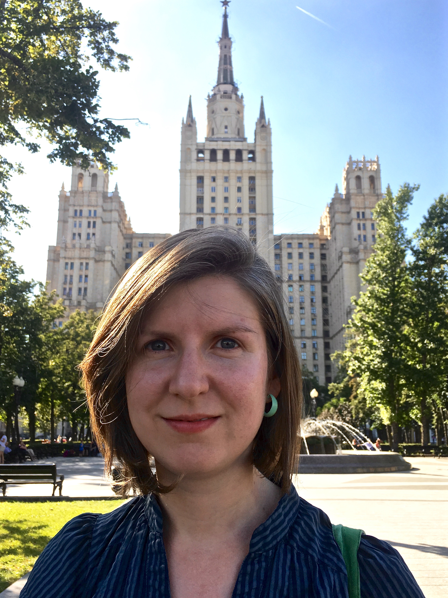

## RESEARCH GROUP MEMBERS

### PI	

&nbsp;

	

	

	

		
 <a href="https://irinagain.github.io"> Irina Gaynanova </a>  
		Assistant Professor of Statistics 

	

<!-- Irina Gaynanova -->

### Postdocs and graduate students

&nbsp;

	<!--

	
-->
	

		
 <a href="https://heech31.github.io"> Hee Cheol Chung </a>  
		Postdoctoral Research Associate	

	

	<!--

	
-->
	

		
Sangyoon Yi  
		Postdoctoral Research Associate	

	

	<!--

	
-->
	

		
Dongbang Yuan  
		PhD Student in Statistics	

	

	<!--

	
-->
	

		
John Schwenck  
		MS Student in Statistics	

	

### Undergraduate students (through [Aggie Research Program](https://aggieresearch.tamu.edu))

* David Buchanan (STAT)
* Elizabeth Chun (BMCB)
* Marielle Hicban (BMEN)
* Nathaniel Fernandez (ENGE)
* Johnathan Shih (STAT)
* Jung Hoon Seo (CPSC)

## RESEARCH GROUP ALUMNI

### Postdocs and graduate students 

* [Tianying Wang](https://tianyingw.github.io). Now an Assistant Professor at  Tsinghua University Center of Statistical Science

* [Grace Yoon](http://www.stat.tamu.edu/~gyoon/). Now a Mathematical Statistician at US Department of Agriculture, National Agricultural Statistics Service (NASS).

* Yunfeng Zhang. Now Data and Applied Scientist at Microsoft.

* Alex Lapanowski. Now Senior Scientist at SABIC.

### Undergraduate students 

Steven Broll (STAT), Eric Wang (ENGE), Sangaman Senthil (INEN), Nhan Nguyen (ENGE), Mary Martin (STAT), Pratik Patel (STAT), Ashok Meyyappan (SPSC)

